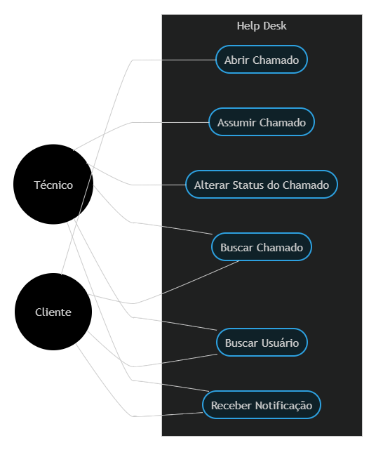
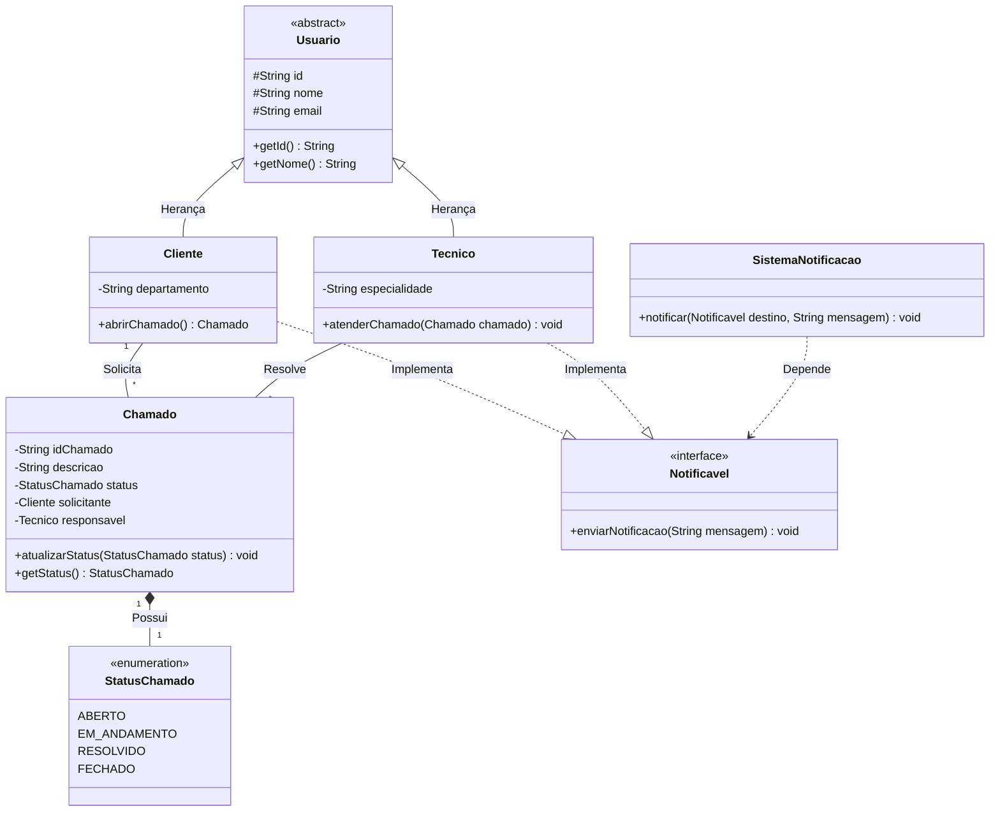
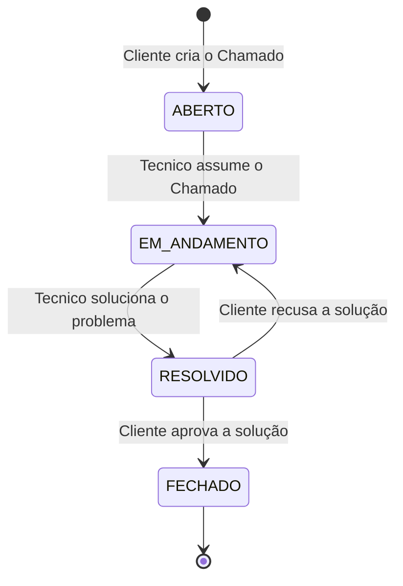

# Sistema de Chamados HelpDesk

### Integrantes: 
- Ana Luiza Costa da Frota
- Kauê Otsubo de Araujo
- Matheus Guilherme Nascimento Soares
- Rodrigo Freitas Medeiros

### Tecnologias Usadas
- Linguagem Java
- JDK (Java Development Kit)
- IntelliJ IDEA

---

## 1 - INTRODUÇÃO DO PROBLEMA E SOLUÇÃO

Em ambientes corporativos ou acadêmicos, a solicitação de suporte técnico muitas vezes ocorre de forma desorganizada (via e-mails perdidos, mensagens informais ou anotações em papel). Isso gera perda de informações, dificuldade em priorizar tarefas críticas, falta de acompanhamento do status do chamado e frustração tanto para quem solicita quanto para quem atende.

---

## 2 - REQUISITOS FUNCIONAIS

- RF01: O sistema deve permitir o cadastro de novos usuários, diferenciando o perfil entre Cliente e Técnico.
- RF02: O sistema deve permitir que um Cliente registre um novo chamado informando a descrição do problema.
- RF03: O sistema deve permitir que um Técnico assuma a responsabilidade pelo atendimento de um chamado.
- RF04: O sistema deve gerenciar e atualizar os status dos chamados (Aberto, Em Andamento, Resolvido, Fechado).
- RF05: O sistema deve acionar uma interface de notificação para alertar os envolvidos quando houver alterações no andamento.
- RF06: O sistema deve possuir uma funcionalidade de busca para consultar usuários e chamados específicos registrados na base.

---

## 3 - CASOS DE USO

---

## 4 - DIAGRAMA DE CLASSES

---

## 5 - DIAGRAMA DE ESTADOS

