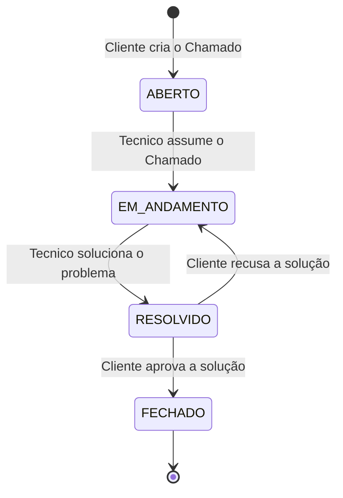
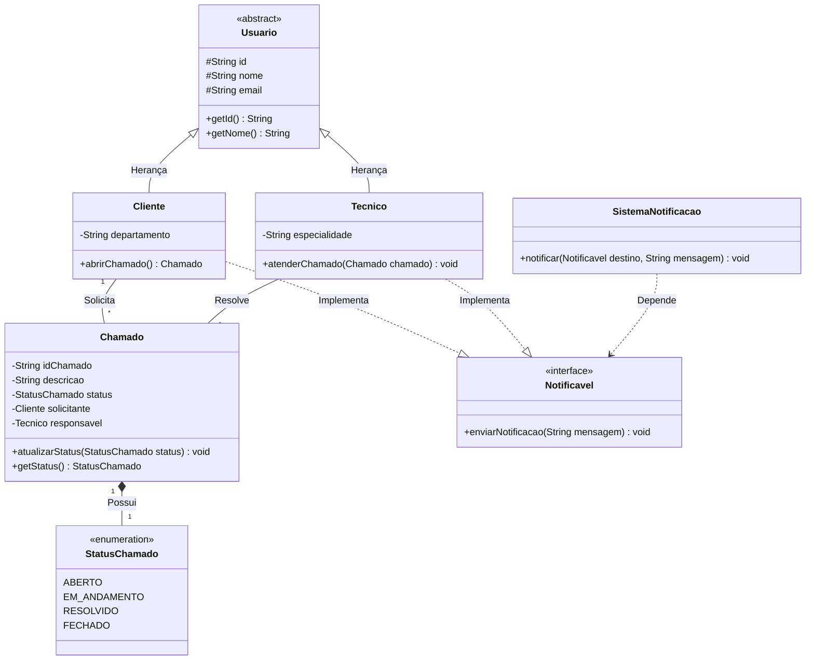

# Sistema de Chamados HelpDesk

### Integrantes: 
- Ana Luiza Costa da Frota
- Kauê Otsubo de Araujo
- Matheus Guilherme Nascimento Soares
- Rodrigo Freitas Medeiros

### Tecnologias Usadas
- Linguagem Java
- JDK (Java Development Kit)
- IntelliJ IDEA

---

## 1 - INTRODUÇÃO DO PROBLEMA

O gerenciamento de serviços de TI em muitas organizações frequentemente sofre com a falta de centralização e rastreabilidade. Em cenários que dependem de planilhas ou e-mails, as solicitações de suporte (chamados) se perdem facilmente, tornando difícil o acompanhamento do status do problema. Além disso, a falta de padronização gera dados inconsistentes, como a duplicação de identificadores, e falhas de comunicação, já que solicitantes e técnicos não são notificados de forma eficiente sobre o progresso do atendimento.

Outro desafio comum em sistemas legados é a rigidez das estruturas de cadastro. Regras de negócio inflexíveis limitam a colaboração da equipe técnica e, na ausência de um tratamento de erros robusto, erros simples de digitação por parte do usuário podem causar instabilidade ou o fechamento inesperado da aplicação, prejudicando a operação diária da infraestrutura de TI.

## 2 - A Solução

Para sanar essas limitações, foi desenvolvido um Sistema Automatizado de Help Desk estruturado em camadas e construído em Java. A solução centraliza o controle de chamados utilizando estruturas de dados em memória (`HashMap`), o que impede cadastros duplicados ao indexar usuários unicamente por seus e-mails. Cada chamado recebe um identificador sequencial automático e tem seu ciclo de vida monitorado de forma segura através de estados predefinidos (`ABERTO`, `EM_ANDAMENTO`, `RESOLVIDO`).

A comunicação e a flexibilidade do sistema foram aprimoradas através da Programação Orientada a Objetos (POO). Utilizando o polimorfismo por meio de uma interface de notificação, o sistema dispara alertas automáticos tanto para clientes quanto para técnicos sempre que há atualizações. Adicionalmente, o software garante a estabilidade da operação ao isolar as responsabilidades do código (Visão, Controle e Modelo) e implementar um tratamento rigoroso de exceções, impedindo que falhas em tempo de execução derrubem a aplicação e assegurando uma experiência fluida para o usuário.

---

## 3 - REQUISITOS FUNCIONAIS

- RF01: O sistema deve permitir o cadastro de novos usuários, diferenciando o perfil entre Cliente e Técnico.
- RF02: O sistema deve permitir que um Cliente registre um novo chamado informando a descrição do problema.
- RF03: O sistema deve permitir que um Técnico assuma a responsabilidade pelo atendimento de um chamado.
- RF04: O sistema deve gerenciar e atualizar os status dos chamados (Aberto, Em Andamento, Resolvido, Fechado).
- RF05: O sistema deve acionar uma interface de notificação para alertar os envolvidos quando houver alterações no andamento.
- RF06: O sistema deve possuir uma funcionalidade de busca para consultar usuários e chamados específicos registrados na base.

---

## 4 - CASOS DE USO

Como ilustrado no diagrama, as interações principais do sistema são divididas entre dois atores:
- **Técnico:** Gerencia o ciclo de vida do chamado (assumir, alterar status, buscar) e consulta usuários.
- **Cliente:** Inicia o processo (abrir chamado) e pode acompanhar (buscar chamado e buscar usuário).
Ambos recebem notificações automáticas do sistema.

---

## 5 - DIAGRAMA DE ESTADOS

O diagrama representa o fluxo de estados que um chamado percorre no sistema, desde a sua abertura até o encerramento definitivo:

- **ABERTO:** O fluxo se inicia quando o **Cliente cria o Chamado**.
- **EM_ANDAMENTO:** O estado é alterado assim que um **Técnico assume o Chamado**.
- **RESOLVIDO:** Quando o **Técnico soluciona o problema**, o chamado avança para este estado. Aqui ocorre uma tomada de decisão por parte do usuário:
    - **Cliente recusa a solução:** O chamado retorna para o estado **EM_ANDAMENTO** para que o técnico trabalhe nele novamente.
    - **Cliente aprova a solução:** O fluxo segue para a etapa final.
- **FECHADO:** O estado final do ciclo de vida, atingido após a validação positiva do cliente.

---

## 6 - DIAGRAMA DE CLASSES

O diagrama de classes ilustra a estrutura do sistema, destacando as relações, tipos de dados e a aplicação prática dos pilares de POO:

- **Herança (Abstração de Usuários):** A classe abstrata `Usuario` serve como base, contendo os atributos comuns (`id`, `nome`, `email`). Dela derivam as classes filhas `Cliente` (que possui o atributo específico `departamento` e o método `abrirChamado`) e `Tecnico` (que possui `especialidade` e o método `atenderChamado`).
- **A Classe Chamado e Associações:** A classe `Chamado` centraliza o negócio. Ela possui uma relação de associação com os envolvidos: armazena um `Cliente` (solicitante) e um `Tecnico` (responsavel). O ciclo de vida do chamado é tipado rigidamente por uma composição com a enumeração `StatusChamado` (`ABERTO`, `EM_ANDAMENTO`, `RESOLVIDO`, `FECHADO`).
- **Polimorfismo e Notificação (Interfaces):** A interface `Notificavel` define o método `enviarNotificacao(String mensagem)`. Tanto `Cliente` quanto `Tecnico` implementam essa interface (indicado pelas setas tracejadas), permitindo que a classe `SistemaNotificacao` envie alertas para qualquer um dos atores de forma genérica e polimórfica através do método `notificar`.

---
